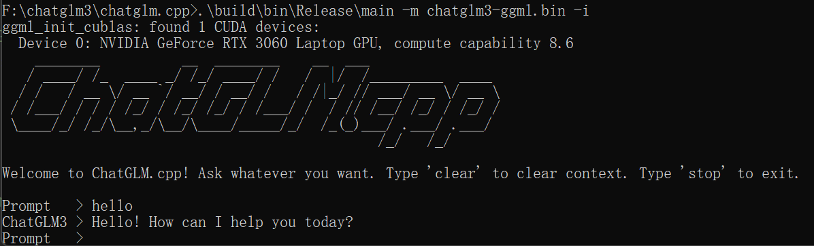

# **本地Chatglm3-6B模型与远程ChatGPT3部署教程**

## 介绍
本项目是基于 github.com/li-plus/chatglm.cpp 的开源项目，目的于实现本地计算机环境下的chatglm3量化模型的部署和远程大模型的api访问。这个教程将指导您完成安装、配置和使用过程。

### 使用方式

将ChatGLM.cpp存储库克隆到本地计算机中:  
`git clone --recursive https://github.com/li-plus/chatglm.cpp.git && cd chatglm.cpp`   
`git submodule update --init --recursive` 

然后配置环境并安装依赖,这里使用conda虚拟环境进行示例:  
`conda create --name chatglm3 python=3.10.0`  
`conda activate  chatglm3`  

然后使用 pip 安装依赖：  
`pip install -r requirements.txt`   
请注意，为了确保torch版本安装正确，requirements.txt并不包含torch，请参照[Pytorch官方文档](https://pytorch.org/get-started/locally/)
安装合适的版本。(要求torch>=2.1.0)

#### 量化模型
注意：这一步并不是必须的,您可以在[魔塔社区](https://www.modelscope.cn/models/Xorbits/chatglm3-ggml/summary)找到量化后的模型。  
执行这一步需要您的本地计算机至少能够载入原模型(完整载入chatglm3-6B需要32gb内存左右)，如果您的本地计算机不满足条件，您可以下载上述提到的量化后的模型版本。  
如果您满足条件，请继续阅读：  
使用convert.py将 ChatGLM3-6B 转换为量化的 GGML 格式。例如，要将 fp16 原始模型转换为q4_0（量化 int4）GGML 模型，请运行：

###### Linux Ubuntu
`python3 chatglm_cpp/convert.py -i THUDM/chatglm3-6b -t q4_0 -o chatglm-ggml.bin`
###### Windows
`python chatglm_cpp/convert.py -i THUDM/chatglm3-6b -t q4_0 -o chatglm-ggml.bin`
原始模型 （ -i <model_name_or_path> ） 可以是 Hugging Face 模型名称，也可以是预下载模型的本地路径。  
可以通过指定以下内容自由尝试以下任何量化类型：  
q4_0 ：使用 FP16 刻度进行 4 位整数量化。  
q4_1 ：具有 FP16 刻度和最小值的 4 位整数量化。  
q5_0 ：使用 FP16 刻度进行 5 位整数量化。  
q5_1 ：具有 FP16 刻度和最小值的 5 位整数量化。  
q8_0 ：使用 FP16 刻度进行 8 位整数量化。  
f16 ：半精度浮点权重，无量化。  
f32 ：单精度浮点权重，无量化。  

##### 编译
###### Linux Ubuntu
执行这一步时，请先确保ubuntu环境里有make, cmake环境
纯CPU环境:   
`cmake -B build`  
`cmake --build build -j --config Release`  
有(nvidia cuda) GPU 环境:  
`cmake -B build -DGGML_CUBLAS=ON && cmake --build build -j --config Release`  
###### Windows
确保Windows环境里有make, cmake环境  
Windows环境下配置make,cmake环境，可以使用Visual Studio Installer安装"使用C++的桌面开发"依赖。
前往[官方网页](https://visualstudio.microsoft.com/)下载Visual Studio  
Windows与Linux Ubuntu环境的 cmake执行命令相同：  
纯CPU环境:   
`cmake -B build`  
`cmake --build build -j --config Release`  
有(nvidia cuda) GPU 环境:  
`cmake -B build -DGGML_CUBLAS=ON && cmake --build build -j --config Release`   
_提示：确保您在全局cmd中运行以上命令，否则可能会出现cuda访问错误_

##### CLI运行
###### Linux Ubuntu
执行命令：  
`./build/bin/main -m chatglm3-ggml.bin -i`
###### Windows
执行命令:  
`.\build\bin\Release\main -m chatglm3-ggml.bin -i`   


##### 绑定python  
###### Linux Ubuntu  
纯CPU环境：  
`pip install -U chatglm-cpp`  
nvidia CUDA环境：　  
`CMAKE_ARGS="-DGGML_CUBLAS=ON" pip install -U chatglm-cpp`  
###### Windows
纯CPU环境：  
对于Windows环境，我建议您于本地Chatglm.cpp克隆仓库目录下运行：  
`pip install .`  
nvidia CUDA环境：　
Windows环境下配置cuda环境比较复杂，首先您需要找到本地克隆仓库下的chatglm.cpp/chatglm_cpp/__init__.py文件
您需要在__init__.py文件的import chatglm_cpp._C as _C之前执行os.add_dll_directory(os.environ['CUDA_PATH'] + '/bin')。
```python
import sys
if sys.version_info >= (3, 8) and sys.platform == "win32":
    import os
    if os.environ.get('CUDA_PATH') is not None:
        os.add_dll_directory(os.environ['CUDA_PATH'] + '/bin')

import chatglm_cpp._C as _C
```
进入conda环境并切换至本地Chatglm.cpp克隆仓库目录下:
`conda active chatglm-cpp`  
`cd chatglm.cpp`  
`set "CMAKE_ARGS=-DGGML_CUBLAS=ON"`   
`pip insatll .`  
_提示：确保你使用全局cmd，否则可能会出现cuda访问错误_

##### 运行api服务器
首先安装额外依赖项
`pip install 'chatglm-cpp[api]'`
###### Linux Ubuntu  
运行命令：
`MODEL=./chatglm3-ggml.bin uvicorn chatglm_cpp.openai_api:app --host 127.0.0.1 --port 8000`
MODEL=后面的路径，根据情况设置模型的实际路径
###### Windows
修改chatglm.cpp/chatglm_cpp目录下的openai_api.py文件：
```python
class Settings(BaseSettings):
    model: str = r"F:\chatglm3\chatglm.cpp\chatglm3-ggml.bin"
    num_threads: int = 0
```
将model路径设置为你的模型路径
于conda环境下运行即可。

##### 运行vue前端  
确保您的本地计算机有npm环境     
进入项目目录   
`cd chatapp`     
安装依赖项     
`npm install`   
修改src/local_config.json和src/remote_config.json配置文件，以适配你使用的远程大模型api和本地大模型api  
启动开发服务器     
`npm run serve`  


##### prompt测试效果
###### 中文
_**中文Prompt**_    
[背景知识]:抽取与某一实体相关的 Key-Value 知识时，可以理解为从给定的数据源中提取与该实体有关的键值对信息。这些键值对可能包含有关实体的各种属性、特征或其他相关信息。
[实体]:[${entity}]
[任务]:请你根据指定的实体抽取相关的Key-Value知识。
[文本]:"""${text}"""
请根据给定的文本，提取出与[${entity}]实体相关的 Key-Value 知识。键应该是实体的属性或特征，而值应该是与该属性或特征相关联的具体信息。
[输出格式]:不要使用markdown，JSON格式,形如
"""
{
"[某个实体]":
  {
    "[特征1]":"[特征1的知识]",
    "[特征2]":"[特征2的知识]"
  },
"[某个实体]":
   {
    "[特征1]":"[特征1的知识]",
    "[特征2]":"[特征2的知识]"
  },
}
"""[某个实体]应该是你的抽取目标[${entity}]之一,你应该用中文作答
,每一个实体应该抽取多个Key-value
[提示]考虑[${entity}]最可能预期的属性或特征`
  
_**文本一**_    
"""
你见过穿上身就能发光发电的纤维吗？关于智能可穿戴设备，你期待它们能带来哪些神奇的功能？
4月5日，东华大学材料科学与工程学院先进功能材料课题组，在《科学》上发表了一项令人瞩目的研究成果。
该研究提出了基于“人体耦合”的能量交互机制，并成功研发出集无线能量采集、信息感知与传输等功能于一体的新型智能纤维。用这种纤维编织制成的智能纺织品，无需依赖芯片和电池便可实现发光显示、触控等人机交互功能。
这一突破性成果，为人与环境的智能交互开辟了新可能，具有广泛应用前景。
智能可穿戴设备正逐渐成为人们生活的一部分。目前，智能纤维的开发多基于“冯·诺依曼架构”，这意味着智能纺织品仍依赖于芯片和电池。这使产品的体积、重量和刚性大，难以同时满足人们对纺织品功能性和舒适性的需求。
东华大学科研团队开创性地提出了“非冯·诺伊曼架构”的新型智能纤维，有效地简化了可穿戴设备和智能纺织品的硬件结构，优化了其可穿戴性。
该研究实现了将能量采集、信息感知、信号传输等功能集成于单根纤维中，并通过编织制成不依赖芯片和电池的智能纺织品。
“不插电”就能发光发电的纤维，到底有什么奥妙？在日常生活中，散布在环境中的电磁能量又是如何“传递”到纤维上的？
该研究提出把人体作为能量交互的载体，开辟了一条便捷的能量“通道”。原本在大气中耗散的电磁能量优先进入纤维、人体、大地组成的回路，恰恰就是这一“日用而不觉”的原理，促成了“人体耦合”的新型能量交互机制。
在添加特定功能材料后，仅仅经过人体触碰，这种新型纤维就会展现发光发电的“神奇一幕”。
“这款新型纤维具有三层鞘芯结构，所采用的均是市面上比较常见的原材料。芯层为感应交变电磁场的纤维天线（镀银尼龙纤维）、中间层为提高电磁能量耦合容量的介电层、外层为电场敏感的发光层。原材料成本低，纤维和织物的加工都能够用成熟的工艺实现，已具备量产能力。”论文第一作者、东华大学材料科学与工程学院博士研究生杨伟峰说。
该研究还展示了这种基于人体耦合原理的智能纤维的几种应用：在不使用芯片和电池的情况下，实现了纤维触控发光、织物显示以及无线指令传输等功能。
东华大学纤维材料改性国家重点实验室研究员侯成义介绍：“这种新型纤维能够运用到服装服饰、布艺装饰等日用纺织品中。当与人体接触时，它会通过发光进行可视化的传感、交互甚至高亮照明，同时还能对人体的不同姿态动作产生无线信号，进而对智能家电等电子产品进行无线遥控。这些新颖的功能有望拓展电子产品的应用场景，甚至改变人们智慧生活的方式。”
课题组组长王宏志教授表示，未来将深入研究如何让这种新型纤维能够更有效地从空间中收集能量，并以此驱动更多功能，包括显示、变形、运算、人工智能等。
"""
提取实体:东华大学,王宏志,纤维,侯成义,杨伟峰
_**Chatglm回答**_   
```json
{
  "东华大学": {"介绍":
    "是一所位于中国的大学，以材料科学和工程为优势",
    "纤维": {
      "介绍":"是一种纺织品，其特征是不需要插电就能发光发电"
    },
    "侯成义": {
      "介绍":"是东华大学纤维材料改性国家重点实验室的研究员",
      "纤维": {
        "介绍":"是侯成义研究的对象，是一种基于人体耦合原理的智能纤维"
      }
    },
    "杨伟峰": {
      "是东华大学材料科学与工程学院的博士研究生",
      "纤维": {
        "介绍":"是杨伟峰研究的对象，是一种基于人体耦合原理的智能纤维",
      }
    },
    "王宏志": {
      "介绍":"是东华大学材料科学与工程学院的教授",
      "纤维": {
        "介绍":"是王宏志研究的对象，是一种基于人体耦合原理的智能纤维"
      }
    }
  }
}
```
_**Chatgpt回答**_ 
```json
{
  "东华大学": {
    "位置": "中国",
    "优势": "材料科学和工程"
  },
  "王宏志": {
    "职称": "教授",
    "所在学院": "材料科学与工程学院"
  },
  "纤维": {
    "特征": "不需要插电就能发光发电",
    "用途": "智能可穿戴设备"
  },
  "侯成义": {
    "职称": "研究员",
    "所在实验室": "纤维材料改性国家重点实验室"
  },
  "杨伟峰": {
    "职称": "博士研究生",
    "所在学院": "材料科学与工程学院"
  }
}
```
_**文本二**_   
随着春季气温上升，人体皮脂分泌量增加，不少脸上爱“出油”的年轻人频频“爆痘”，苦恼不堪。中医专家提示，对于痤疮这种皮肤顽疾，中西医结合、内外合治具有一定优势，患者日常也要从饮食、作息等方面加强预防。
中国中医科学院西苑医院皮肤科副主任医师佘远遥介绍，痤疮是一种发生于毛囊和皮脂腺的慢性炎症，过度分泌的皮脂与灰尘、老化角质细胞混合，容易堵塞毛孔，表现为粉刺、丘疹、脓疱、结节等多种形式，反复发作。其发病主要和不良情绪、作息不规律、大便不通畅等因素有关。此外，皮肤经常过敏的人群因皮肤敏感脆弱，皮肤屏障功能下降，也相对容易感染痤疮丙酸杆菌而出现痤疮。
“痤疮完全可控可治，但通常至少需要两三个月时间。”佘远遥说，通过内服中药、西药并结合外用药物、中医针灸、光电治疗这样的中西医结合治疗方式，坚持足疗程治疗通常会有较好的效果，患者要有耐心和信心。
那么，什么样的痤疮患者需要治疗？佘远遥说，如果仅出现两三颗“青春痘”尤其是以粉刺为主，可以不用治疗，但“痘痘”长得较多或较重，或者出现大的结节、囊肿，则需要系统规范治疗。
佘远遥介绍，具体而言，粉刺如果不多，可以外治法为主，比如在患处涂抹维甲酸类药物，或进行中药“清痘”、中医针灸治疗。如果出现炎性丘疹甚至伴有脓疱结节，建议在外治基础上增加一些中药或西药的口服药，其中，口服中药治疗采取辨证论治、一人一方的个体化治疗方式，即根据症状、舌象、脉象来制定个性化的治疗方案，如清肺胃湿热、活血化瘀、调理冲任等。
担心“冒痘”降低“颜值”，生活中该如何预防？中国中医科学院西苑医院皮肤科住院医师张益生建议，每日认真清洁面部，规律作息，保持大便通畅，注意防晒，同时，饮食上要少吃高糖高脂和辛辣食物及曾经导致“冒痘”的食物。（记者田晓航）
"""
提取实体:佘远遥,痤疮,治疗,预防,张益生
_**Chatglm回答**_   
```json
{
  "佘远遥": 
  {"痤疮": "富强可治，但通常至少需要两三个月时间.", 
  "治疗": "通过内服中药、西药并结合外用药物、中医针灸、光电治疗这样的中西医结合治疗方式，坚持足疗程治疗通常会有较好的效果。",
  "预防": "生活中该如何预防？每日认真清洁面部，规律作息，保持大便通畅，注意防晒，同时，饮食上要少吃高糖高脂和辛辣食物及曾经导致‘冒痘’的食物。"
  },
"痤疮": {
  "介绍":"粉刺长得较多或较重，或者出现大的结节、囊肿，则需要系统规范治疗。", 
  "治疗": "口服中药治疗采取辨证论治、一人一方的个体化治疗方式，即根据症状、舌象、脉象来制定个性化的治疗方案，如清肺胃湿热、活血化瘀、调理冲任等。", 
  "预防": "避免长时间化妆品覆盖、不规范的减肥饮食、生活压力大等。"
},
"张益生": {"医生的建议": "担心‘冒痘’降低‘颜值’，生活中该如何预防？每日认真清洁面部，规律作息，保持大便通畅，注意防晒，同时，饮食上要少吃高糖高脂和辛辣食物及曾经导致‘冒痘’的食物。"}
}
```
_**Chatgpt回答**_      
```json
{
    "佘远遥": {
        "职称": "中医科学院西苑医院皮肤科副主任医师",
        "专业领域": "皮肤科",
        "治疗观点": "认为痤疮完全可控可治，但通常需两三个月时间，建议中西医结合治疗，坚持足疗程治疗通常会有较好效果，患者要有耐心和信心"
    },
    "痤疮": {
        "定义": "发生于毛囊和皮脂腺的慢性炎症，皮脂与灰尘、老化角质细胞混合堵塞毛孔，表现为粉刺、丘疹、脓疱、结节等多种形式，发作主要与不良情绪、作息不规律、大便不通畅等因素有关，皮肤经常过敏的人群容易感染"
    },
    "治疗": {
        "方法": "中西医结合治疗，包括内服中药、西药、外用药物、中医针灸、光电治疗，根据症状个体化制定治疗方案",
        "疗程": "通常至少需要两三个月时间，坚持足疗程治疗通常会有较好效果"
    },
    "预防": {
        "建议": "每日认真清洁面部，规律作息，保持大便通畅，注意防晒，饮食上少吃高糖高脂和辛辣食物及曾经导致冒痘的食物"
    },
    "张益生": {
        "职称": "中国中医科学院西苑医院皮肤科住院医师",
        "建议": "每日认真清洁面部，规律作息，保持大便通畅，注意防晒，饮食上少吃高糖高脂和辛辣食物及曾经导致冒痘的食物"
    }
}
```
_**文本三**_
"""
中新网天津4月6日电 4月6日，2024年“鲁能杯”全国少儿足球邀请赛天津站在天津生圣泽奇足球公园闭幕，来自京津冀的28支球队经过三天共70场比赛的激烈较量，决出了四个组别的冠军归属。
经过三天的激烈角逐，来自天津的坤晟松足球俱乐部斩获U8组冠军，保定森翔足球俱乐部和北京启明星红队分列二、三；U9组冠军获得者是天津恒骏足球俱乐部，二、三名分别是沧州凯胜足球俱乐部和天津坤晟松足球俱乐部；保定森翔足球俱乐部捧起U10组冠军奖杯，该组别亚军和季军分别是秦皇岛秦皇少年足球俱乐部和北京京都启明星队；U11组金牌被石家庄NAKATA足球俱乐部摘得，北京启程足球俱乐部获得银牌，天津博德足球俱乐部拿下铜牌。
个人奖项方面，U8、U9、U10和U11四个组的最佳射手分别是天津坤晟松足球俱乐部的张森予、天津恒骏足球俱乐部的秦俊熊、北京京都启明星队的盛贺轩和北京启拓足球俱乐部的王传佳。天津坤晟松足球俱乐部的孙博然、天津恒骏足球俱乐部的吕浩骏、保定森翔足球俱乐部的高博轩和石家庄NAKATA足球俱乐部的王彦程分别获得U8、U9、U10和U11四个组的最佳球员。
按照赛事规程，获得本届“鲁能杯”全国少儿足球邀请赛天津站四个组别前三名的队伍，将拿到“鲁能杯”全国少儿足球邀请赛北区争霸赛的入场券。届时，12支球队将和更多高水平的队伍一较高下，展现小球员们在场上的英姿。
足球不仅仅是竞技体育，也是对球员们毅力、团队精神和个人能力的全面检验。小球员们在球场上的出色表现，不仅赢得了现场观众的阵阵掌声，更为自己赢得了宝贵的经验和难得的成长。“看到小球员们在场上不停拼搏，我们觉得这次比赛办的很有意义。未来我们还将继续支持中国足球事业的发展，尤其是在青少年培训方面。”天津三好餐饮有限公司董事长马宁说。
本次赛事是由天津市东丽区文化旅游体育局指导，山东鲁能泰山足球学校主办。“鲁能杯”全国少儿足球邀请赛是山东鲁能泰山足球学校于2001年创建并主办的青少年足球传统年度品牌赛事，赛事旨在为全国青少年搭建一个互相交流、共同提升的赛事平台。弘扬体育精神，推动全民健身运动发展，让更多的小球员实现足球梦想。（王在御）
"""
实体:“鲁能杯”全国少儿足球邀请赛,天津恒骏足球俱乐部,张森予,北京,盛贺轩
_**Chatglm回答**_   
```json
{"鲁能杯”全国少儿足球邀请赛": 
  {"参赛队伍": "全国各州 cup 代表队",
  "比赛地点": "全国各地", 
  "比赛时间": "全国各地"}, 
"天津恒骏足球俱乐部": 
{"球队地址": "天津市",
  "球队老板": "天津三好餐饮有限公司",
  "球队场地": "天津市",
  "球队创建时间": "2001年", 
  "球队季节": "四季"}, 
"张森予": 
{"比赛进球": "5个",
  "比赛助攻": "3个", 
  "比赛姓名": "张森予", 
  "比赛年龄": "12岁",
  "比赛位置": "前锋"}, 
"北京": {"比赛城市": "北京市", 
  "比赛场地": "北京市",
  "比赛时间": "北京市", 
  "比赛参赛队伍": "全国各地杯代表队"}, 
"盛贺轩": {"比赛进球": "4个",
  "比赛助攻": "2个",
  "比赛姓名": "盛贺轩", 
  "比赛年龄": "11岁", 
  "比赛位置": "中场"}}
```
_**Chatgpt回答**_  
```json
{
    "“鲁能杯”全国少儿足球邀请赛": {
        "比赛地点": "天津生圣泽奇足球公园",
        "比赛时间": "2024年4月6日",
        "参赛队伍数量": 28,
        "比赛场次": 70,
        "冠军球队": ["坤晟松足球俱乐部", "天津恒骏足球俱乐部", "保定森翔足球俱乐部", "石家庄NAKATA足球俱乐部"],
        "最佳射手": {
            "U8组": "张森予",
            "U9组": "秦俊熊",
            "U10组": "盛贺轩",
            "U11组": "王传佳"
        },
        "最佳球员": {
            "U8组": "孙博然",
            "U9组": "吕浩骏",
            "U10组": "高博轩",
            "U11组": "王彦程"
        }
    },
    "天津恒骏足球俱乐部": {
        "所在城市": "天津市",
        "球队老板": "天津三好餐饮有限公司",
        "成立时间": "2001年",
        "季节": "四季"
    },
    "张森予": {
        "年龄": 12,
        "位置": "前锋",
        "进球数": 5,
        "助攻数": 3
    },
    "北京": {
        "比赛城市": "北京市",
        "比赛时间": "2024年4月6日",
        "参赛队伍": "全国各地杯代表队"
    },
    "盛贺轩": {
        "年龄": 11,
        "位置": "中场",
        "进球数": 4,
        "助攻数": 2
    }
}
```
  
###### English
_**Prompt**_    
Answer in English:[Background knowledge]: When extracting Key Value knowledge related to a certain entity, it can be understood as extracting key value pair information related to that entity from a given data source. These key value pairs may contain various attributes, features, or other relevant information about the entity.
[Entity]: [${entity}]
[Task]: Please extract relevant Key Value knowledge based on the specified entity.
[Text]: "" ${text} ""
Please extract Key Value knowledge related to the [${entity}] entity based on the given text. Keys should be attributes or features of entities, while values should be specific information associated with that attribute or feature.
[Output Format]: Do not use Markdown. Instead,use JSON format which shape like
""“
{
[Entity 1]:
{
"[Feature 1]": "[Knowledge of Feature 1]",
"[Feature 2]": "[Knowledge of Feature 2]"
},
[Entity 2]:
{
"[Feature 1]": "[Knowledge of Feature 1]",
"[Feature 2]": "[Knowledge of Feature 2]"
},
}
[Entity #] should be one of your extraction targets [${entity}]，Answer in English
Each entity should extract multiple Key values
[Tip] Consider the most likely expected attribute or feature of [${entity}].Answer in English
  
_**Text1**_  
Data supplied from AirDNA, which tracks listings on holiday rental sites Airbnb and Vrbo, found 342,000 short-term lets available in the UK in the 12 months to February 2024, up 19% on the previous year. New listings for homes in the UK jumped 22% year on year in 2023, while new apartment listings increased by 16%.
Yvonne Turnbull, 58, who lives in Horsham, West Sussex, has been letting out a three-bedroom apartment in Scarborough, North Yorkshire, for between £150 and £175 a night, including through Airbnb, for the past six years.
She said demand was significantly down on previous years, with no bookings for January, February or March, including half-term, and fewer bookings over Easter. Turnbull said Scarborough was now oversupplied with holiday lets. “When we started there were about 200 Airbnbs in the town. Now you’re looking at 1,000.”
Nor is the problem limited to seaside destinations. Veeve, which offers short-term rentals, has seen a 21% drop in booking values across its London portfolio of more than 500 properties from January to 19 March since the same period last year.
Entity:AirDNA,Yvonne Turnbull,Veeve,Airbnb,Scarborough  
_**Chatglm Response**_   
```json
{
"AirDNA": {
" website": "www.airdna.com",
" platform": "Holiday lettings",
" listings": "Over 500,000 properties worldwide",
" markets": "Local, national and international"
},
"Yvonne Turnbull": {
" name": "Yvonne Turnbull",
" age": "58",
" address": "Horsham, West Sussex",
" occupation": "Landlord",
" property": {
" address": "Scarborough, North Yorkshire",
" type": "Apartment",
" size": "3 bedrooms",
" price": "Between £150 and £175 per night",
" listings": "Over 6 years on Airbnb"
},
" demand": {
" booking_values": "Significantly down on previous years",
" no_bookings": "January, February, March and half-term",
" fewer_bookings": "Easter"
}
},
"Veeve": {
" name": "Veeve",
" website": "www. veeve.com",
" platform": "Short-term rentals",
" properties": "Over 500 properties worldwide",
" markets": "Local, national and international",
" listings": "Over 2 million listings worldwide"
},
"Scarborough": {
" location": "Scarborough, North Yorkshire",
" listings": "Over 1,000 holiday lets",
" oversupplied": "With holiday lets",
" problems": "Significant drop in booking values and fewer bookings"
}
}
```
_**Chatgpt Response**_  
```json
{
"AirDNA":
  {
    "website": "www.airdna.com",
    "platform": "Holiday lettings",
    "listings": "Over 500,000 properties worldwide",
    "markets": "Local, national and international"
  },
"Yvonne Turnbull":
  {
    "name": "Yvonne Turnbull",
    "age": "58",
    "address": "Horsham, West Sussex",
    "occupation": "Landlord",
    "property_address": "Scarborough, North Yorkshire",
    "property_type": "Apartment",
    "property_size": "3 bedrooms",
    "property_price": "Between £150 and £175 per night",
    "property_listings_duration": "Over 6 years on Airbnb",
    "demand_booking_values": "Significantly down on previous years",
    "demand_no_bookings": "January, February, March and half-term",
    "demand_fewer_bookings": "Easter"
  },
"Veeve":
  {
    "name": "Veeve",
    "website": "www.veeve.com",
    "platform": "Short-term rentals",
    "properties": "Over 500 properties worldwide",
    "markets": "Local, national and international",
    "listings": "Over 2 million listings worldwide",
    "booking_values_drop": "21% drop in booking values across its London portfolio",
    "booking_values_period": "From January to 19 March",
    "properties_London": "More than 500 properties"
  },
"Scarborough":
  {
    "location": "Scarborough, North Yorkshire",
    "listings": "Over 1,000 holiday lets",
    "oversupply": "With holiday lets",
    "problems": "Significant drop in booking values and fewer bookings"
  }
}
```
_**Text2**_
In 2012 an Irish parliamentary committee hearing had degenerated into a raucous shouting match when a voice cut through the mayhem. “Chillax,” said Simon Harris. “I think everyone needs to take a step back here.”
The 25-year-old legislator’s intervention silenced and mystified his colleagues. One wondered if chillax was Latin. Use of the word made headlines. “All the young people know what ‘chillax’ is,” Harris told the Dáil the next day.
He showed little sign of chilling or relaxing himself, however, and instead became a political vortex who 12 years later is poised to become Ireland’s youngest prime minister. His social media skills have prompted a nickname, the “TikTok taoiseach”.
On 9 April the Dáil is expected to confirm Harris, 37, as successor to Leo Varadkar, who stunned the country last month when he announced his resignation as prime minister and leader of Fine Gael.
The higher education minister blitzed potential rivals to be coronated as the party’s new leader. Fine Gael’s coalition partners, Fianna Fáil and the Greens, back him to become taoiseach.
It will be the culmination of a precocious rise for a polished communicator who has rewritten the political rulebook in Ireland but is barely known in Belfast, London or Brussels.
“At this stage there is more interest in why Leo left than who is Simon Harris but that will very quickly turn to who is Simon,” said Frances Fitzgerald, a Fine Gael MEP and former minister who mentored Harris at the start of his career.
The new taoiseach will face daunting challenges. A housing crisis and fraying public services dim the centre-right coalition’s hopes of winning an election due by next March. Farmers are chafing at environmental rules while climate activists lament missed targets. Post-Brexit relations with London are tetchy and Northern Ireland’s government is fragile. About a third of Fine Gael’s Dáil deputies are stepping down rather than face voters.
Yet Harris has reputedly yearned for this opportunity since he was a teenager. “He’s acutely and almost obsessionally ambitious,” said Shane Ross, a former Fine Gael and independent politician who served in cabinet with Harris and knew him as a newly elected legislator in 2011. “He was always in a hurry, even at that time. Very early on he declared his leadership ambitions.”
Harris has humble roots. He grew up in Greystones, a County Wicklow coastal town south of Dublin, the son of a taxi driver and a school special needs assistant, and attended St Joseph’s, a community school.
He was a keen debater and wrote a play at 13, said Neale Richmond, a junior minister who has known Harris for 20 years. “The work ethic comes from his parents, they’re work, work, work.”
Having a younger brother with Asperger syndrome prompted the 15-year-old Harris to lobby politicians for autism services, instilling a passion for public service, said Richmond. “Simon is very good craic and obsessed with politics. Always in a rush, he walks very quickly and talks very quickly. It’s all about what you can do as quickly as possible.”
Entity:Simon Harris,The Greens,Greystones,Neale Richmond,Leo Varadkar
_**Chatglm Response**_  
```json
{
"Simon Harris":
  {
    "Party": "The Greens",
    "Roots": "Greystones",
    "Ambition": "Humble roots",
    "Early On": "Declared leadership ambitions",
    "Work Ethic": "Good craac and obsessed with politics",
    "Obsession": "Always in a rush",
    "Crazy about politics": "Very good craic",
    "Good Craic": "Always in a rush"
  },
"The Greens":
  {
    "Green": "Environmental friendly",
    "Values": "Sustainable development",
    "Purpose": "Preserving the environment"
  },
"Greystones":
  {
    "Coastal Town": "South of Dublin",
    "Community School": "St Joseph's",
    "Keen Debater": "Wrote a play at 13",
    "Passion for Public Service": "Lobbied politicians for autism services"
  },
"Neale Richmond":
  {
    "Junior Minister": "Known Harris for 20 years",
    "Passion for Politics": "Always in a hurry",
    "Good Craic": "Very good craac",
    "Work Ethic": "Humble roots",
    "Crazy about Politics": "Always in a rush"
  },
"Leo Varadkar":
  {
    "Former Fine Gael and Independent Politician": "Served in cabinet with Harris",
    "Leadership Ambitions": "Acutely and almost obsessionally ambitious",
    "Humble Roots": "Harris grew up in Greystones",
    "Public Service": "Yearned for this opportunity since he was a teenager",
    "Early On": "Declared leadership ambitions"
  }
}
```
_**Chatgpt Response**_  
```json
{
"Simon Harris": {
  "Age": "37",
  "Political Affiliation": "Fine Gael",
  "Previous Position": "Higher Education Minister",
  "Nickname": "TikTok taoiseach",
  "Background": "Grew up in Greystones, County Wicklow",
  "Education": "Attended St Joseph’s community school",
  "Family Background": "Son of a taxi driver and a school special needs assistant",
  "Early Activism": "Lobbied politicians for autism services due to his brother's Asperger syndrome",
  "Personality Traits": ["Obsessed with politics", "Acutely ambitious", "Polished communicator", "Known for quick walking and talking"]
},
"The Greens": {
  "Position on Harris": "Back him to become taoiseach",
  "Political Coalition": "Supports the centre-right coalition with Fine Gael and Fianna Fáil"
},
"Greystones": {
  "Location": "Coastal town in County Wicklow, south of Dublin",
  "Community": "Where Simon Harris grew up",
  "Characteristics": ["Close to the sea", "Coastal scenery"],
  "Education": "Location of St Joseph’s community school"
},
"Neale Richmond": {
  "Relationship with Harris": "Known Simon Harris for 20 years",
  "Testimonial": "Describes Harris as 'very good craic' and 'obsessed with politics'",
  "Observations": ["Harris walks very quickly and talks very quickly", "Emphasizes quick action and efficiency"]
},
"Leo Varadkar": {
  "Successor": "Expected to be succeeded by Simon Harris",
  "Reason for Resignation": "Announced resignation as prime minister and leader of Fine Gael",
  "Timing of Resignation": "Last month prior to Harris's expected confirmation as taoiseach"
}
}
```
_**Text3**_  
Dotted along the length of Britain’s rivers are various obstacles – some as large as dams, others as small as weirs (which bisect a river like steps) – stopping creatures, sediment and plants from moving along the watercourse. Only 1% of the UK’s rivers are free of artificial barriers.
Moves are under way in many countries to remove such obstacles and let rivers “re-naturalise” and follow their own paths. But while many scientists agree that river barriers need to go in the UK too, other people are hesitant – concerned about creating unpredictable water flows in already flood-prone regions.
“Our rivers and our lakes are the most damaged of all ecosystems,” says Paul Kemp, a professor of ecological engineering at the University of Southampton. Globally, freshwater ecosystems are home to about a third of the planet’s vertebrate species, and these have been declining at twice the rate of marine and land-based animals. The situation in England is dire, with about 15% of rivers achieving good ecological status, according to the Rivers Trust.
Removing barriers “results in the greatest impact the most rapidly and for the least amount of money,” says Kemp.
In England, there are more than 50,000 barriers disrupting the passage of the country’s beleaguered rivers, according to the Environment Agency database. Scientists within the organisation suspect that there are many more. The overwhelming majority of these are relatively small: about 27,500 culverts, usually round concrete pipes, and around 16,300 weirs, which adjust the water level and effectively create a small dam.
These barriers are not only costly to maintain – they also cause avoidable environmental damage.
“A few decades ago, we thought only migratory species needed to move,” says Dr Perikles Karageorgopoulos, a senior technical specialist at the Environment Agency. “But we increasingly understand that all species need to move, from the tiniest ones that will have local migrations through to the others that migrate for many kilometres to overwinter or reach their spawning grounds.” Having so many barriers effectively creates a network of small dams or lakes, which offer plants and animals very different habitats from those found in free-flowing rivers, and are often not appropriate for river species.
Entity:Britain's rivers,Paul Kemp,Freshwater ecosystems,Environment Agency,Perikles Karageorgopoulos
_**Chatglm Response**_  
```json
{
"Britain's rivers": {
"River barriers": {
"Cost of maintenance": "High",
"Environmental damage": "High"
},
"Migration patterns": {
"Local migrations": {},
"Long-distance migrations": {}
}
},
"Paul Kemp": {
"Professional background": "Environmental scientist",
"Research focus": "Freshwater ecosystems"
},
"Freshwater ecosystems": {
"Habitat creation": {
"Different habitats": "Yes",
"Appropriateness for river species": "No"
},
"Migration patterns": {
"Local migrations": {},
"Long-distance migrations": {}
}
},
"Environment Agency": {
"Agency role": "Regulator and controller of rivers",
"Data source": "Environment Agency database"
},
"Perikles Karageorgopoulos": {
"Professional background": "Environmental engineer",
"Work location": "Environment Agency"
}
}
```
_**Chatgpt Response**_  
```json
{
  "Britain's rivers": {
    "Obstacles": "Various obstacles such as dams and weirs are dotted along Britain's rivers",
    "Barrier Percentage": "Only 1% of the UK’s rivers are free of artificial barriers",
    "Barrier Types": ["Dams", "Weirs", "Culverts"],
    "Environmental Impact": "Removing barriers is seen as crucial for river health and ecosystem restoration"
  },
  "Paul Kemp": {
    "Profession": "Professor of ecological engineering at the University of Southampton",
    "Expertise": "Specializes in ecological engineering and environmental restoration",
    "Views on River Barriers": "Believes removing barriers results in the greatest impact for river health",
    "Affiliation": "Affiliated with the University of Southampton"
  },
  "Freshwater ecosystems": {
    "Global Importance": "Home to about a third of the planet’s vertebrate species",
    "Decline Rate": "Vertebrate species in freshwater ecosystems are declining at twice the rate of marine and land-based animals",
    "Ecological Status in England": "Only about 15% of rivers in England achieve good ecological status according to the Rivers Trust",
    "Need for Restoration": "Acknowledged as the most damaged of all ecosystems, highlighting the urgency for restoration efforts"
  },
  "Environment Agency": {
    "Database Records": "More than 50,000 barriers disrupting the passage of rivers in England according to the Environment Agency database",
    "Barrier Types": ["Culverts", "Weirs"],
    "Concerns": "Suspected presence of many more barriers than currently recorded",
    "Efforts": "Scientists within the Environment Agency are working to address barriers and improve river health"
  },
  "Perikles Karageorgopoulos": {
    "Profession": "Senior technical specialist at the Environment Agency",
    "Expertise": "Specializes in understanding the impact of barriers on aquatic ecosystems",
    "Views on Species Movement": "Emphasizes the importance of species movement for all species, not just migratory ones",
    "Affiliation": "Affiliated with the Environment Agency"
  }
}
```